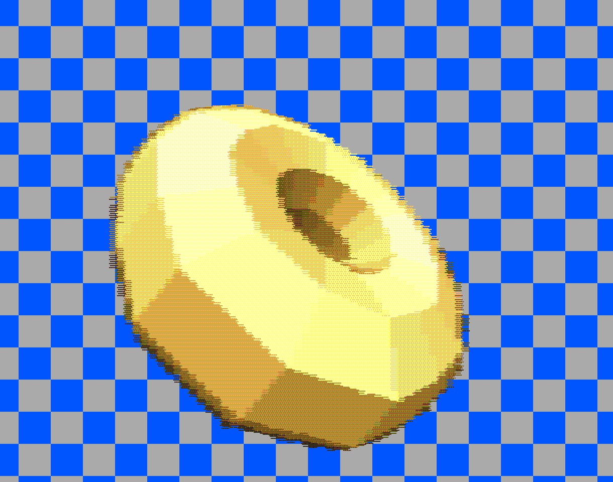

   

# Tiny Tapeout Verilog Project - VGA donut

Full write-up [on my blog](https://www.a1k0n.net/2025/01/10/tiny-tapeout-donut.html).

This is a racing-the-beam raymarching VGA output implementation of good ol'
[donut.c](https://www.a1k0n.net/2021/01/13/optimizing-donut.html).

- [Read the documentation for project](docs/info.md)

## What is Tiny Tapeout?

Tiny Tapeout is an educational project that aims to make it easier and cheaper than ever to get your digital and analog designs manufactured on a real chip.

To learn more and get started, visit https://tinytapeout.com.

